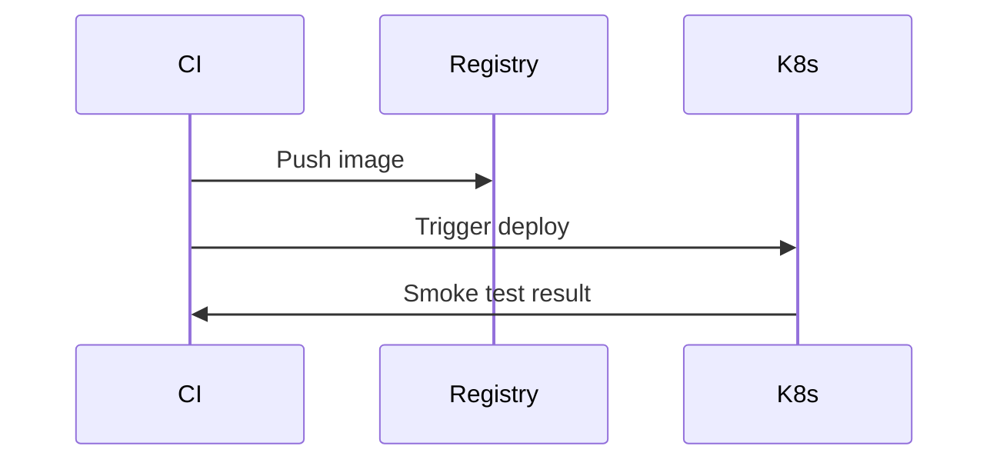

Purpose: Define staging/production deployment patterns, CD pipeline, environments, and rollback strategy.

Architecture:
- Use containerized services deployed to Kubernetes or managed services (Vercel for frontend, Cloud Run/ECS for API/workers).
- Use IaC (Terraform) to provision networking, DB (managed Postgres), Redis, and object storage.

Workflow:
- CI builds images, runs tests, pushes images to registry.
- CD deploys to staging, runs smoke tests, then promotes to production with canary.

Mermaid (deploy flow):

Security: signed images, runtime policies, network segmentation, secrets in secret manager.

Scalability: autoscale workloads, use horizontal pod autoscaler and read replicas for DB.

Failure & Recovery: implement health checks, rollbacks on failed health checks, snapshot backups for DB.
