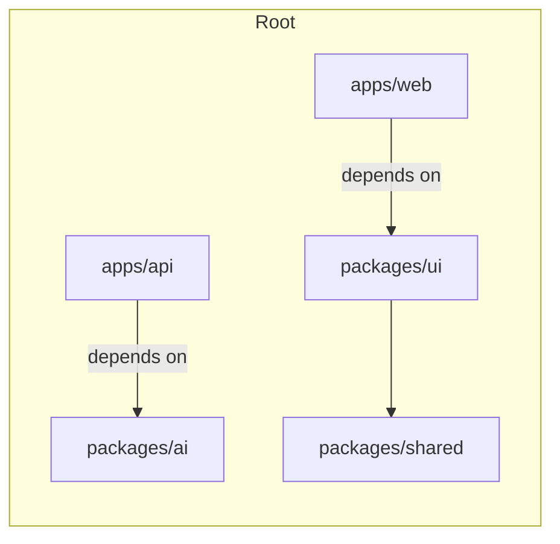

Purpose: Describe workspace layout, package boundaries, dependency rules, and tooling (pnpm, turbo, workspace policies).

Architecture:
- Root workspace with `apps/` (deployables) and `packages/` (libraries). Use `pnpm` workspaces and `turbo` for orchestration.

Responsibilities:
- `apps/web`: Next.js frontend
- `apps/api`: API server and lightweight workers
- `packages/ui`: design system
- `packages/ai`: AI orchestration
- `packages/shared`: types and utilities

Workflow:
- Local dev: `pnpm install` → `pnpm -w dev` runs affected projects.
- CI: run `pnpm -w lint`, `pnpm -w test`, `pnpm -w build` per package.

Mermaid (high-level):

Security Considerations: enforce package access rules, avoid publishing secrets, use `pnpm` lockfile.

Scalability: separate build caches and CI pipelines per package; use turborepo caching.

Performance: parallelize builds, use incremental caching.

Best Practices: single source of types in `packages/shared`, explicit dependency boundaries.
